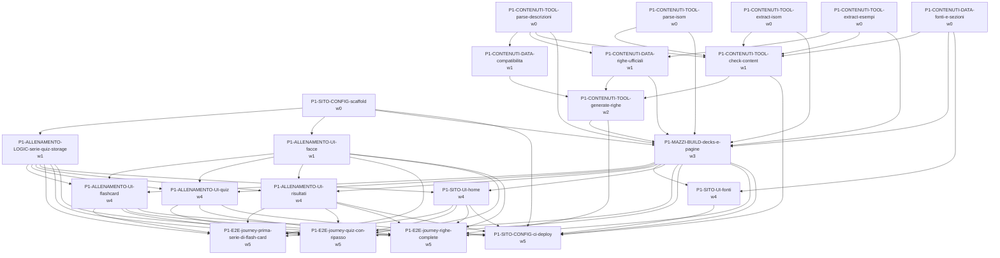

<!-- GENERATED by scripts/tasks/regenerate-views.ts from _index.json — DO NOT EDIT (_dependency-graph.md) -->

# orient — Dependency graph

```mermaid
graph TD
  P1_CONTENUTI_DATA_fonti_e_sezioni["P1-CONTENUTI-DATA-fonti-e-sezioni\nw0"]
  P1_CONTENUTI_TOOL_extract_esempi["P1-CONTENUTI-TOOL-extract-esempi\nw0"]
  P1_CONTENUTI_TOOL_extract_isom["P1-CONTENUTI-TOOL-extract-isom\nw0"]
  P1_CONTENUTI_TOOL_parse_descrizioni["P1-CONTENUTI-TOOL-parse-descrizioni\nw0"]
  P1_CONTENUTI_TOOL_parse_isom["P1-CONTENUTI-TOOL-parse-isom\nw0"]
  P1_SITO_CONFIG_scaffold["P1-SITO-CONFIG-scaffold\nw0"]
  P1_ALLENAMENTO_LOGIC_serie_quiz_storage["P1-ALLENAMENTO-LOGIC-serie-quiz-storage\nw1"]
  P1_SITO_CONFIG_scaffold --> P1_ALLENAMENTO_LOGIC_serie_quiz_storage
  P1_ALLENAMENTO_UI_facce["P1-ALLENAMENTO-UI-facce\nw1"]
  P1_SITO_CONFIG_scaffold --> P1_ALLENAMENTO_UI_facce
  P1_CONTENUTI_DATA_compatibilita["P1-CONTENUTI-DATA-compatibilita\nw1"]
  P1_CONTENUTI_TOOL_parse_descrizioni --> P1_CONTENUTI_DATA_compatibilita
  P1_CONTENUTI_DATA_righe_ufficiali["P1-CONTENUTI-DATA-righe-ufficiali\nw1"]
  P1_CONTENUTI_TOOL_parse_descrizioni --> P1_CONTENUTI_DATA_righe_ufficiali
  P1_CONTENUTI_TOOL_extract_esempi --> P1_CONTENUTI_DATA_righe_ufficiali
  P1_CONTENUTI_TOOL_check_content["P1-CONTENUTI-TOOL-check-content\nw1"]
  P1_CONTENUTI_TOOL_parse_descrizioni --> P1_CONTENUTI_TOOL_check_content
  P1_CONTENUTI_TOOL_parse_isom --> P1_CONTENUTI_TOOL_check_content
  P1_CONTENUTI_TOOL_extract_isom --> P1_CONTENUTI_TOOL_check_content
  P1_CONTENUTI_TOOL_extract_esempi --> P1_CONTENUTI_TOOL_check_content
  P1_CONTENUTI_DATA_fonti_e_sezioni --> P1_CONTENUTI_TOOL_check_content
  P1_CONTENUTI_TOOL_generate_righe["P1-CONTENUTI-TOOL-generate-righe\nw2"]
  P1_CONTENUTI_DATA_righe_ufficiali --> P1_CONTENUTI_TOOL_generate_righe
  P1_CONTENUTI_DATA_compatibilita --> P1_CONTENUTI_TOOL_generate_righe
  P1_CONTENUTI_TOOL_check_content --> P1_CONTENUTI_TOOL_generate_righe
  P1_MAZZI_BUILD_decks_e_pagine["P1-MAZZI-BUILD-decks-e-pagine\nw3"]
  P1_SITO_CONFIG_scaffold --> P1_MAZZI_BUILD_decks_e_pagine
  P1_CONTENUTI_TOOL_parse_descrizioni --> P1_MAZZI_BUILD_decks_e_pagine
  P1_CONTENUTI_TOOL_parse_isom --> P1_MAZZI_BUILD_decks_e_pagine
  P1_CONTENUTI_TOOL_extract_isom --> P1_MAZZI_BUILD_decks_e_pagine
  P1_CONTENUTI_TOOL_extract_esempi --> P1_MAZZI_BUILD_decks_e_pagine
  P1_CONTENUTI_DATA_fonti_e_sezioni --> P1_MAZZI_BUILD_decks_e_pagine
  P1_CONTENUTI_DATA_righe_ufficiali --> P1_MAZZI_BUILD_decks_e_pagine
  P1_CONTENUTI_TOOL_generate_righe --> P1_MAZZI_BUILD_decks_e_pagine
  P1_ALLENAMENTO_UI_flashcard["P1-ALLENAMENTO-UI-flashcard\nw4"]
  P1_MAZZI_BUILD_decks_e_pagine --> P1_ALLENAMENTO_UI_flashcard
  P1_ALLENAMENTO_LOGIC_serie_quiz_storage --> P1_ALLENAMENTO_UI_flashcard
  P1_ALLENAMENTO_UI_facce --> P1_ALLENAMENTO_UI_flashcard
  P1_ALLENAMENTO_UI_quiz["P1-ALLENAMENTO-UI-quiz\nw4"]
  P1_MAZZI_BUILD_decks_e_pagine --> P1_ALLENAMENTO_UI_quiz
  P1_ALLENAMENTO_LOGIC_serie_quiz_storage --> P1_ALLENAMENTO_UI_quiz
  P1_ALLENAMENTO_UI_facce --> P1_ALLENAMENTO_UI_quiz
  P1_ALLENAMENTO_UI_risultati["P1-ALLENAMENTO-UI-risultati\nw4"]
  P1_MAZZI_BUILD_decks_e_pagine --> P1_ALLENAMENTO_UI_risultati
  P1_ALLENAMENTO_LOGIC_serie_quiz_storage --> P1_ALLENAMENTO_UI_risultati
  P1_ALLENAMENTO_UI_facce --> P1_ALLENAMENTO_UI_risultati
  P1_SITO_UI_fonti["P1-SITO-UI-fonti\nw4"]
  P1_MAZZI_BUILD_decks_e_pagine --> P1_SITO_UI_fonti
  P1_CONTENUTI_DATA_fonti_e_sezioni --> P1_SITO_UI_fonti
  P1_SITO_UI_home["P1-SITO-UI-home\nw4"]
  P1_MAZZI_BUILD_decks_e_pagine --> P1_SITO_UI_home
  P1_ALLENAMENTO_LOGIC_serie_quiz_storage --> P1_SITO_UI_home
  P1_E2E_journey_prima_serie_di_flash_card["P1-E2E-journey-prima-serie-di-flash-card\nw5"]
  P1_SITO_UI_home --> P1_E2E_journey_prima_serie_di_flash_card
  P1_ALLENAMENTO_UI_flashcard --> P1_E2E_journey_prima_serie_di_flash_card
  P1_ALLENAMENTO_UI_facce --> P1_E2E_journey_prima_serie_di_flash_card
  P1_MAZZI_BUILD_decks_e_pagine --> P1_E2E_journey_prima_serie_di_flash_card
  P1_ALLENAMENTO_UI_risultati --> P1_E2E_journey_prima_serie_di_flash_card
  P1_ALLENAMENTO_LOGIC_serie_quiz_storage --> P1_E2E_journey_prima_serie_di_flash_card
  P1_E2E_journey_quiz_con_ripasso["P1-E2E-journey-quiz-con-ripasso\nw5"]
  P1_SITO_UI_home --> P1_E2E_journey_quiz_con_ripasso
  P1_ALLENAMENTO_UI_quiz --> P1_E2E_journey_quiz_con_ripasso
  P1_ALLENAMENTO_UI_flashcard --> P1_E2E_journey_quiz_con_ripasso
  P1_ALLENAMENTO_UI_facce --> P1_E2E_journey_quiz_con_ripasso
  P1_MAZZI_BUILD_decks_e_pagine --> P1_E2E_journey_quiz_con_ripasso
  P1_ALLENAMENTO_UI_risultati --> P1_E2E_journey_quiz_con_ripasso
  P1_ALLENAMENTO_LOGIC_serie_quiz_storage --> P1_E2E_journey_quiz_con_ripasso
  P1_E2E_journey_righe_complete["P1-E2E-journey-righe-complete\nw5"]
  P1_SITO_UI_home --> P1_E2E_journey_righe_complete
  P1_ALLENAMENTO_UI_flashcard --> P1_E2E_journey_righe_complete
  P1_ALLENAMENTO_UI_quiz --> P1_E2E_journey_righe_complete
  P1_ALLENAMENTO_UI_facce --> P1_E2E_journey_righe_complete
  P1_MAZZI_BUILD_decks_e_pagine --> P1_E2E_journey_righe_complete
  P1_ALLENAMENTO_UI_risultati --> P1_E2E_journey_righe_complete
  P1_ALLENAMENTO_LOGIC_serie_quiz_storage --> P1_E2E_journey_righe_complete
  P1_CONTENUTI_TOOL_generate_righe --> P1_E2E_journey_righe_complete
  P1_SITO_CONFIG_ci_deploy["P1-SITO-CONFIG-ci-deploy\nw5"]
  P1_SITO_CONFIG_scaffold --> P1_SITO_CONFIG_ci_deploy
  P1_CONTENUTI_TOOL_check_content --> P1_SITO_CONFIG_ci_deploy
  P1_MAZZI_BUILD_decks_e_pagine --> P1_SITO_CONFIG_ci_deploy
  P1_SITO_UI_home --> P1_SITO_CONFIG_ci_deploy
  P1_ALLENAMENTO_UI_flashcard --> P1_SITO_CONFIG_ci_deploy
  P1_ALLENAMENTO_UI_quiz --> P1_SITO_CONFIG_ci_deploy
  P1_ALLENAMENTO_UI_risultati --> P1_SITO_CONFIG_ci_deploy
  P1_SITO_UI_fonti --> P1_SITO_CONFIG_ci_deploy
```
